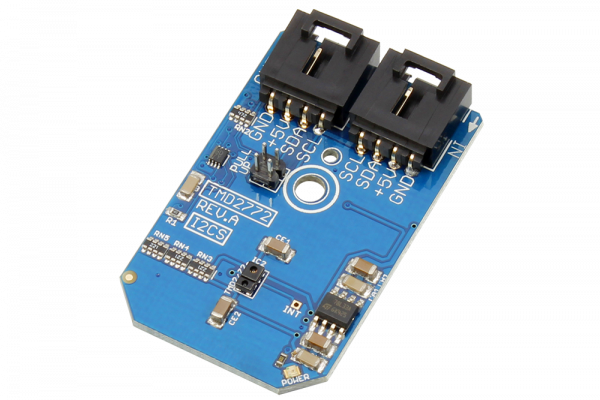

# TMD2772

Manufactured by AMS, the TMD2772 provides digital ambient light sensing (ALS), a complete proximity detection system, and digital interface logic.The ALS enhancements include a reduced-gain mode that extends the operating range in sunlight. Proximity detection includes improved signal-to-noise performance and more accurate factory calibration.
This Device is available from www.ncd.io 

[SKU: TMD2772_I2CS]

(https://store.ncd.io/product/tmd2772-digital-ambient-light-and-proximity-sensor-i2c-mini-module/)
This Sample code can be used with Arduino.

Hardware needed to interface TMD2772 sensor with Arduino

1. <a href="https://store.ncd.io/product/i2c-shield-for-arduino-nano/">Arduino Nano</a>

2. <a href="https://store.ncd.io/product/i2c-shield-for-arduino-micro-with-i2c-expansion-port/">Arduino Micro</a>

3. <a href="https://store.ncd.io/product/i2c-shield-for-arduino-uno/">Arduino uno</a>

4. <a href="https://store.ncd.io/product/dual-i2c-shield-for-arduino-due-with-modular-communications-interface/">Arduino Due</a>

5. <a href="https://store.ncd.io/product/tmd2772-digital-ambient-light-and-proximity-sensor-i2c-mini-module/">TMD2772 Digital Ambient Light and Proximity Sensor</a>

6. <a href="https://store.ncd.io/product/i%C2%B2c-cable/">I2C Cable</a>

TMD2772:

Manufactured by AMS, the TMD2772 provides digital ambient light sensing (ALS), a complete proximity detection system, and digital interface logic.The ALS enhancements include a reduced-gain mode that extends the operating range in sunlight. Proximity detection includes improved signal-to-noise performance and more accurate factory calibration.

Applications:

• Mobile Handset Touchscreen Control and Automatic Speakerphone Enable

• Mechanical Switch Replacement

• Paper Alignment

• Digital Signage

How to Use the TMD2772 Arduino Library

The TMD2772 has a number of settings, which can be configured based on user requirements.
          
1.Accessing time setting:The following command is used to set the accessing time of TMD2772 sensor.

            tmd.setATime(ATIME_2_73MS);                 // Cycles: 1, Time: 2.73 ms Max Count: 1024
         
 2.Proximity Interrupt time:The following command is used to set the Proximity Interrupt time.
 
            tmd.setPTime(PTIME_2_73MS);                 // Cycles: 1, Time: 2.73 ms Max Count: 1023
            
3.Wait time:The following command is used to set the wait time for sensor.

            tmd.setWTime(WTIME_1);                      // Wait Time: 1, Time (WLONG = 0): 2.73 ms Time (WLONG = 1):  0.033 sec
           
4.Proximity drive:The following command is used to set the proximity drive.

             tmd.setProximityDrive(PDRIVE_100);          // LED Strength – PDL=0: 100%, LED Strength – PDL=1: 11.1%
           
5.Proximity diode selection:The following command is used for the selection of diode.             
           
              tmd.setProximityDiode(PDIODE_CH1);          // Proximity Uses the CH1 Diode
              
6.Proximity gain setting:The following command is used to set the proximity gain of sensor.            
              
              tmd.setProximityGain(PGAIN_1X);             // Proximity Gain: 1X
              
7.ALS gain setting:The following command is used to set the ALS gain of sensor.              
              
              tmd.setALSGain(AGAIN_1X);                   // ALS Gain: 1X
             
